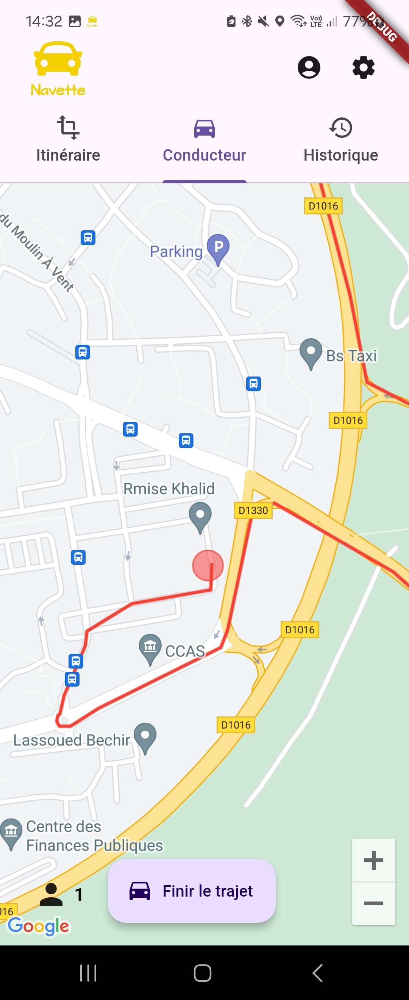
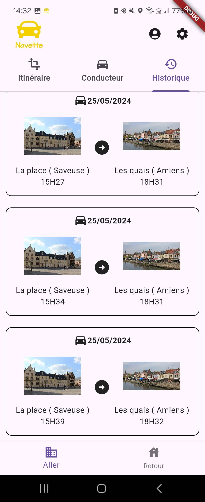
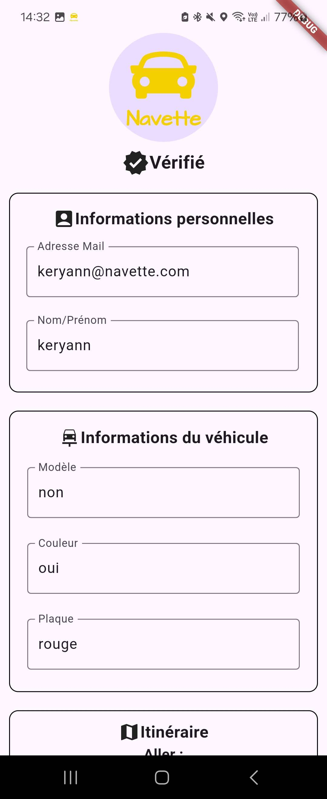
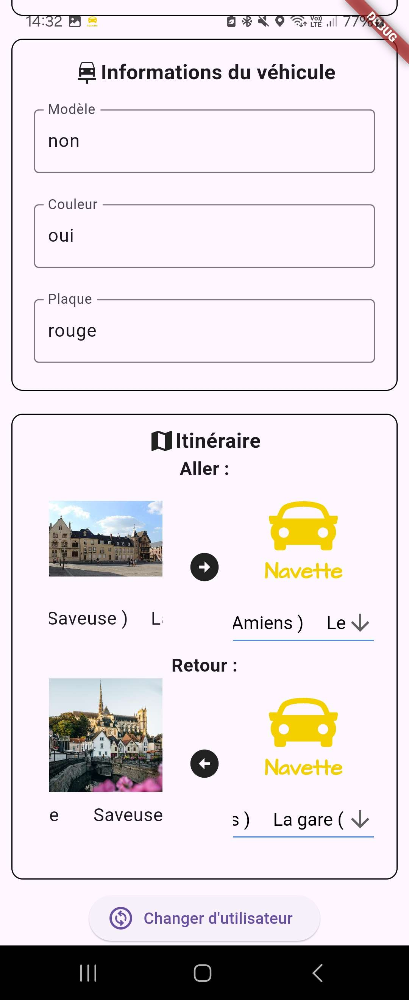

# Navette

Navette est une application de covoiturage périurbain développée dans le cadre d'un projet à l'Université de Picardie Jules Verne. Elle se concentre sur les flux importants de déplacements entre les communes périphériques et une grande ville.

L'idée principale de Navette est d'optimiser ces déplacements en établissant des points d'arrêt stratégiques où les passagers peuvent attendre et où les conducteurs peuvent facilement les prendre en charge pour les déposer à leurs destinations. Ce système fonctionne de manière similaire aux services de bus ou de métro, mais avec une flexibilité accrue, car chaque utilisateur peut choisir d'être conducteur ou passager.

L'application se base aussi sur l'utilisation de balises afin de détecter les arrêts / conducteurs  afin de demander le minimum d'interaction à l'utilisateur

## Screenshot

1. Trajets en cours


2. Interface Conducteur


3. Historique des trajets


4. Compte utilisateur



## Table des matières
1. [Fonctionnalités](#fonctionnalités)
2. [Prérequis](#prérequis)
3. [Installation](#installation)
4. [Utilisation](#utilisation)
5. [Licence](#licence)

## Fonctionnalités
- Visualisation des trajets en cours avec le nombre d'utilisateur et la fréquentation estimée
- Création d'un trajet avec guidage GPS et visualisation du nombre de passager
- Visualisation de l'historique des trajets
- Détection des balises en arrière plan
- Notifications en temps réel

## Prérequis
- [Flutter](https://flutter.dev/docs/get-started/install)
- [API Navette](https://github.com/tanguynicolas/Navette)
- [Clé API Google maps](https://developers.google.com/maps)

## Installation
1. Clonez le dépôt
    ```
    git clone https://github.com/KeryannJ/Navette.git
    ```
2. Accédez au répertoire du projet
    ```
    cd Navette
    ```
3. Installez les dépendances
    ```
    flutter pub get
    ```

## Utilisation
1. Lancez l'application
    ```
    flutter run
    ```

## Licence
Ce projet est sous licence MIT. Voir le fichier [LICENSE](LICENSE) pour plus de détails.